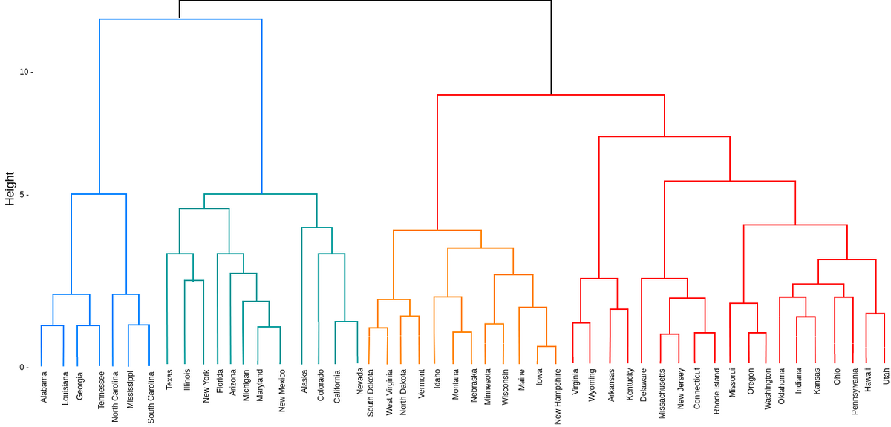

Prompt 
1. Given 128 variables, decide which variables can be dropped or combined.
2. Hint: Check differences between similar variables. Compare the means, medians for skewness, standard deviation, percentiles and share of each state in each variable 

Client questions 
1. Please rank states by population, poverty, household, education, income, deaths, births, income levels or rates. 
2. Are higher death rates mainly due to higher population ? If not can we assume deaths refer to crime rates ? Does education in such cases differ than states will less deaths ?
3. Is Migration in and out states related to the wages ? Do states with married households have a higher migratation rate ? That would mean families move into this state together often which is interesting information.
4. How do states with a diversified population race wise differ from those with one or two dominant races ?
5. How does the age of each state's population impact its income ? Do states with younger people earn more than states with more senior citizens 

6. Create a final report and show why these states are clustered together and what they have in common. Your stakeholders can then choose to look into a specific cluster or state to implement their US projects.

What would have been helpful 
1. Meta data information: Because this data set did not come with a meta data, I had to make a lot of assumptions. 